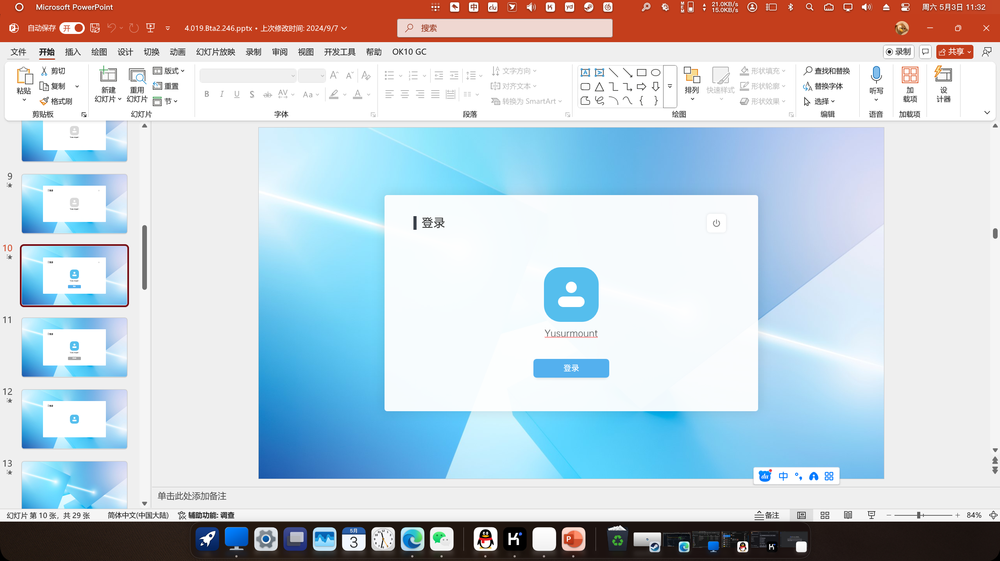

![CC BY-NC-SA 4.0][cc-by-nc-sa-shield]
 \

[cc-by-nc-sa]: http://creativecommons.org/licenses/by-nc-sa/4.0/
[cc-by-nc-sa-shield]: https://img.shields.io/badge/License-CC%20BY--NC--SA%204.0-lightgrey.svg
> ### :warning: 此版本为非完整版，许多功能存在缺失
# Leaf OS 4.0
Leaf OS 是一个基于 PowerPoint 制作的虚拟操作系统界面，旨在通过 PPT 的交互功能模拟操作系统的用户体验。
它包含多个界面组件和交互逻辑，展示了如何利用 PPT 创造出类似操作系统的视觉和交互效果。

## 开始使用
直接从发行版下载使用

## 开发工具
• Microsoft PowerPoint：用于创建和开发 PPT 文件。（需2016 版本以上）
> 不要使用WPS

## 界面预览
 \
 \
 

## 开源协议

该项目采用 [Attribution-NonCommercial-ShareAlike 4.0 International](LICENSE) 许可证。
> (许可证官方链接)[http://creativecommons.org/licenses/by-nc-sa/4.0/]

## 联系方式

• 作者author：小沈（化名）

• 昵称Nickname：雨夌、Yusurmount、Yuling （同一人）

• 邮箱Email：yusurmount@qq.com

• GitHub：[Yusurmount（雨夌）](https://github.com/Yusurmount/)

• 抖音：[雨夌（ID：Yusurmount）](https://v.douyin.com/m72B2TMKGeQ/)

---
© 2025 雨夌 版权所有
---
